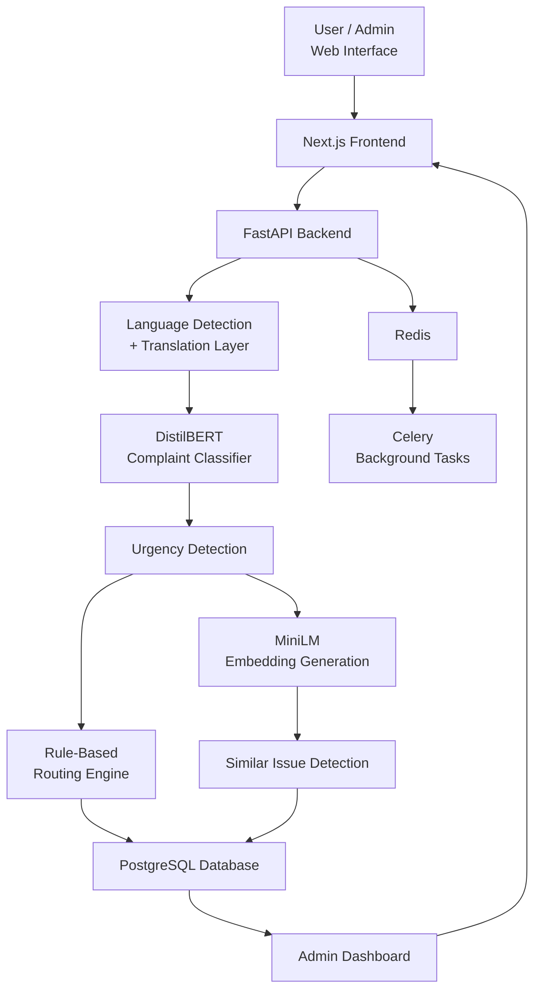
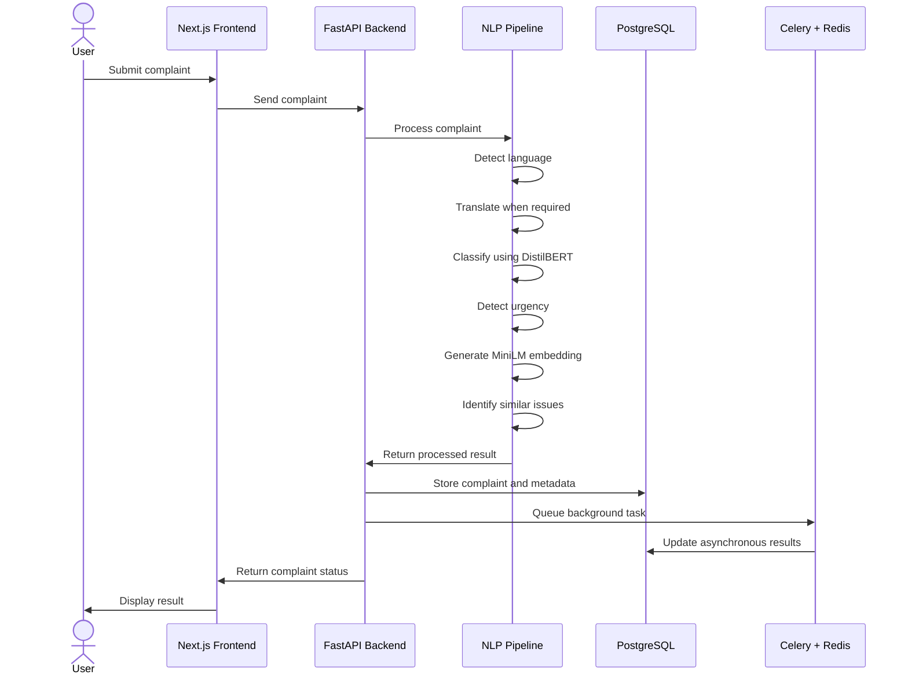
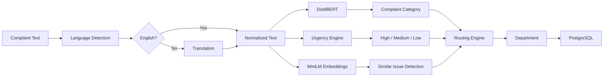
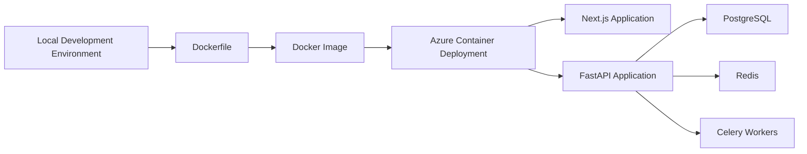
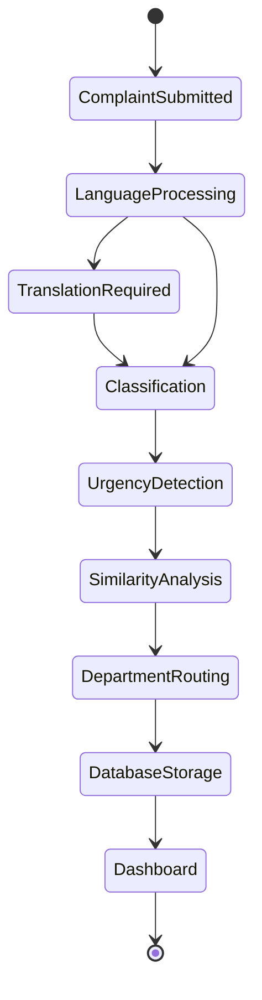

# 🧠 Automated Grievance Categorization & Routing System

An AI-powered grievance management system that automates complaint handling using **NLP and machine learning**. The system accepts multilingual complaints, translates them when required, classifies them using **DistilBERT**, detects urgency, identifies similar issues using **MiniLM embeddings**, and routes complaints to the appropriate department.

> **Project Status:** Archived / Development Concluded  
> The original implementation has been preserved in its existing state and is presented as a completed project. The deployed application remains available as a live demonstration.

---

## 📌 Project Overview

Handling large numbers of complaints manually can make categorization, prioritization, and routing time-consuming. This project presents a lightweight automated workflow for processing grievances from submission to departmental routing.

The system provides:

- 🌍 **Multilingual complaint handling**
- 🧠 **AI-based complaint categorization**
- 🚨 **Urgency detection**
- 🏢 **Automatic department routing**
- 🔎 **Similar-issue identification**
- 📊 **Complaint analytics dashboard**
- 🔐 **JWT-based authentication**
- ⚡ **Asynchronous task processing with Celery and Redis**
- 🗄️ **PostgreSQL-based complaint storage**

The implementation was designed as a **hackathon-ready MVP**, prioritizing a working end-to-end pipeline, lightweight components, and clear modular separation.

---

## ✨ Key Features

### 🌍 Multilingual Input

Users can submit complaints in different languages.

Example:

```text
"Hostel la water problem iruku"
```

The processing layer detects the language and translates the complaint into English when required.

```text
Water problem in hostel
```

---

### 🧠 Complaint Categorization

The translated complaint is passed to a **DistilBERT-based classification layer**.

Example:

```text
Input:
"Water is not available in my hostel for two days."

Output:
Category: Hostel
```

Typical categories can include:

- Hostel
- Fees
- IT Support
- Academics
- Infrastructure
- Transport
- General Administration

---

### 🚨 Urgency Detection

The system uses a lightweight hybrid approach for identifying urgency.

Example keywords:

```text
"urgent"
"immediately"
"emergency"
```

A simplified rule flow:

```text
Urgent / Immediate / Emergency → HIGH
Soon / Important              → MEDIUM
Otherwise                     → LOW
```

The approach can be extended with a dedicated urgency model in future versions.

---

### 🏢 Automatic Complaint Routing

After classification, a rule-based routing layer maps the complaint category to the appropriate department.

Example:

```text
Hostel  → Hostel Office
Fees    → Accounts
IT      → IT Support
```

This keeps routing transparent, predictable, and easy to modify.

---

### 🔎 Similar Issue Detection

The system uses **MiniLM embeddings** to represent complaint text and identify semantically similar complaints.

This can help administrators detect recurring issues even when users describe the same problem using different wording.

Example:

```text
"Hostel water supply has stopped."
"There's no water in my hostel."
"Water is unavailable in the hostel."
```

These complaints can be recognized as related issues.

> This similarity layer is used for issue discovery and analytics; the MVP does not depend on a separate RAG system.

---

### 📊 Admin Dashboard

The dashboard provides an overview of processed complaints, including:

- Total complaints
- Complaints by category
- High-priority complaints
- Department-wise distribution
- Recurring or similar complaints
- Complaint processing information

---

### 🔐 Authentication

The application includes **JWT-based authentication** for secure access to protected functionality.

---

### ⚡ Background Processing

**Celery** and **Redis** are used to support asynchronous processing where required.

This allows computational or background tasks to be separated from the main API request flow.

---

## 🏗️ System Architecture



---

## 🔄 End-to-End Processing Flow



---

## 🧩 Core Processing Pipeline



---

## 🚀 Deployment Architecture

The application was developed locally, containerized using **Docker**, and deployed to an **Azure container-based environment**.



### Deployment Flow

```text
Local Development
       ↓
Dockerization
       ↓
Docker Image
       ↓
Azure Container Deployment
       ↓
Live Application
```

---

## 🛠️ Technology Stack

| Layer | Technology |
|---|---|
| Frontend | Next.js |
| Backend | FastAPI |
| Database | PostgreSQL |
| Authentication | JWT |
| Complaint Classification | DistilBERT |
| Semantic Similarity | MiniLM Embeddings |
| Background Tasks | Celery |
| Task Broker / Cache | Redis |
| Containerization | Docker |
| Deployment | Azure Container-based Deployment |
| Dashboard | Next.js |
| Translation | Translation API / Lightweight Translation Layer |

---

## 🔄 Application Workflow



---

## 🗃️ Data Stored

The complaint record can contain information such as:

| Field | Description |
|---|---|
| `complaint_text` | Original complaint submitted by the user |
| `translated_text` | English-normalized complaint text |
| `category` | Predicted complaint category |
| `urgency` | High / Medium / Low |
| `department` | Department assigned to the complaint |
| `timestamp` | Complaint submission time |
| `similarity_metadata` | Information related to similar issues |

---

## 📈 Recurring Issue Detection

Repeated issues can be surfaced using a combination of complaint categories and semantic similarity.

A simple analytical approach is:

```sql
SELECT category, COUNT(*) AS complaint_count
FROM complaints
GROUP BY category
ORDER BY complaint_count DESC;
```

For example:

```text
Hostel       → 42
Infrastructure → 31
IT Support   → 18
Fees         → 12
```

MiniLM embeddings can additionally help group complaints that use different wording but refer to a similar underlying problem.

---

## 🔐 Security

The application includes:

- JWT-based authentication
- Protected API functionality
- Backend-side request validation
- Database-backed persistence

Authentication and authorization are handled at the backend/API layer.

---

## 📁 Conceptual Project Structure

The implementation follows a frontend/backend architecture similar to:

```text
project/
│
├── frontend/
│   └── Next.js application
│
├── backend/
│   ├── API routes
│   ├── NLP processing
│   ├── classification
│   ├── urgency detection
│   ├── routing logic
│   ├── database integration
│   └── authentication
│
├── workers/
│   └── Celery tasks
│
├── Dockerfile
├── docker-compose.yml
└── README.md
```

> The above structure is a conceptual representation of the application architecture and should not be treated as a current source-code recovery guide.

---

## 🧠 AI / NLP Components

### DistilBERT

Used as the primary complaint classification model.

```text
Complaint
   ↓
Tokenizer
   ↓
DistilBERT
   ↓
Predicted Category
```

### MiniLM

Used to generate compact text embeddings for identifying semantically similar complaints.

```text
Complaint A ──┐
              ├──> MiniLM ──> Embeddings ──> Similarity Analysis
Complaint B ──┘
```

### Translation Layer

Multilingual complaints are normalized into English before downstream classification.

```text
Multilingual Input
       ↓
Language Detection
       ↓
Translation when required
       ↓
English Text
       ↓
NLP Pipeline
```

---

## ⚙️ Design Principles

The MVP was designed around:

- **Lightweight components**
- **Modular architecture**
- **Reliable rule-based routing**
- **Fast complaint processing**
- **Clear separation between frontend, backend, and data layers**
- **Easy extensibility for future features**

The focus was on demonstrating a complete working pipeline rather than introducing unnecessary infrastructure.

---

## 🚫 Features Intentionally Outside the MVP

The MVP does not depend on:

- RAG / ChromaDB
- Voice input
- WhatsApp integration
- Firebase notification workflows
- Large multilingual transformer models
- SLA-based escalation systems
- Advanced ML-based forecasting
- Complex autonomous agent workflows

These can be considered possible extensions rather than core requirements.

---

## 🔮 Future Extensions

The architecture can be extended with:

- 🤖 RAG-powered complaint assistance
- 📱 Omnichannel complaint submission
- 🎙️ Voice-based complaints
- 🔔 Automated notifications
- ⏱️ SLA-based escalation
- 📊 Advanced analytics and trend prediction
- 🌐 Dedicated multilingual transformer models
- 🧠 More advanced semantic clustering

---

## ☁️ Deployment

### Containerization

The application was containerized from the local development environment using Docker.

```text
Source Application
      ↓
Dockerfile
      ↓
Docker Image
      ↓
Container Runtime
```

### Azure

The containerized application was deployed through an Azure container-based environment, providing the live demonstration currently associated with this project.

---

## 🌐 Live Application

### 🚀 Deployed Demo

**Live Demo:** [Open the deployed application](https://grievance-frontend.jollytree-5ba7f231.centralindia.azurecontainerapps.io/)

> The live deployment is the primary available demonstration of the completed implementation.

---

## 📌 Project Status

### Archived — Development Concluded

This project is preserved as a record of the completed implementation and its deployment.

The original source implementation remains in its existing state, while the live deployment continues to serve as the accessible demonstration of the project.

This repository should therefore be viewed primarily as a **project showcase and implementation reference**, rather than an actively evolving codebase.

---

## 🎯 Project Highlights

```text
Multilingual Input
       ↓
Translation
       ↓
DistilBERT Classification
       ↓
Urgency Detection
       ↓
MiniLM Similarity Analysis
       ↓
Department Routing
       ↓
PostgreSQL Storage
       ↓
Admin Dashboard
       ↓
Azure Container Deployment
```

---

## 🏁 Summary

The **Automated Grievance Categorization & Routing System** demonstrates an end-to-end AI-assisted workflow for grievance management.

It combines:

**Next.js + FastAPI + DistilBERT + MiniLM + PostgreSQL + Redis + Celery + JWT + Docker + Azure**

to provide a practical workflow for:

> **Submit → Translate → Classify → Prioritize → Detect Similar Issues → Route → Store → Analyze**

The project was designed as a compact, modular, and deployment-ready MVP suitable for demonstrating the practical application of NLP and machine learning in complaint management.

---

## 📜 Project Note

This repository documents the architecture, technology choices, workflow, and deployment of the project. The currently available live application represents the final demonstrable implementation.

**Status:** `Archived`  
**Deployment:** `Dockerized → Azure Container Deployment`  
**Live Demo:** `Available`
